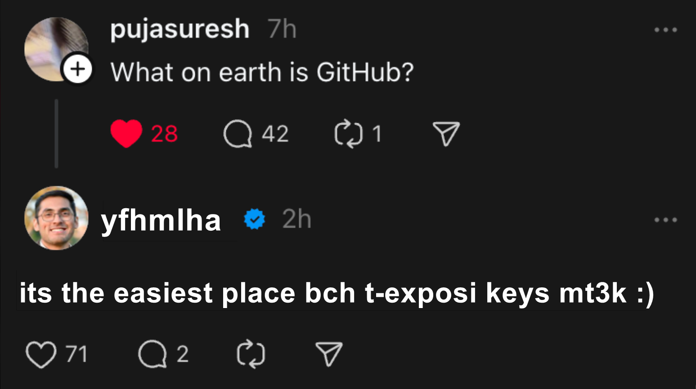

# PULL FROM `beta2` BRANCH TO YOUR PRIVATE BRANCH BEFORE PUSHING

## To check custom commands made by team memebers, see [Commands.md](./Commands.md)

## Download dependencies

```sh
composer install
```

## How to start a server with Symfony

```sh
symfony server:start 
symfony serve
```

## migration

```sh
symfony console make:migration
symfony console doctrine:migrations:migrate
```

> [!WARNING]
> if you have foreign key constraints, drop the database then recreate it.

```sh
symfony console doctrine:database:drop --force
symfony console doctrine:database:create
```

then do the migration again

## clear cache

```sh
symfony console cache:clear
```

> [!WARNING]
> change the path of the assets in the twig files example:
> 
> `css/style.css` -> `front_office/css/style.css` OR `back_office/css/style.css`.

Database Name : `Sou9_NFT`

`DATABASE_URL="mysql://root:@127.0.0.1:3306/Sou9_NFT"`

## How to Setup Oath (SSL)

Type `php --ini` to get the path of php.ini file

Then in your php.ini file insert or edit the following line: curl.cainfo = pathtothisfile\cacert.pem"

[original issue](https://stackoverflow.com/questions/37997669/curl-error-60-ssl-certification-issue-when-attempting-to-use-symfony)

## `symfony.lock` or `composer.lock` errors

you can delete them and execute `composer install`



### and remember guys , ken fmma mchkl raw SSL 😉   